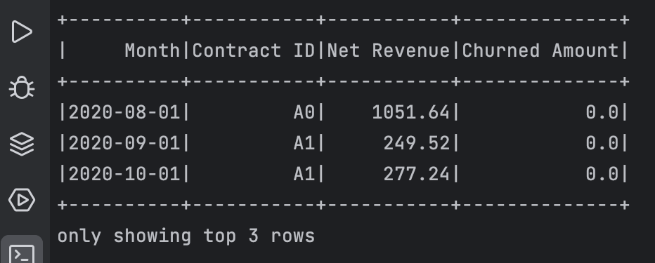

# re:cap Data Tech Challenge

---
## Description
This repository contains a Python solution to fetch invoice data from Acme Corp's API. The raw data is locally stored 
as a csv file and later processed to compute net revenue and churned amount per month. 
The solution is split into two main tasks:

- `Task 1:` Fetching all invoices from the API and saving them to a file named **Acme_Corp_Data.csv**.
- `Task 2:` Generating a table with two additional columns namely **Net Revenue** 
and **Churned Amounts** derived from the monthly invoices.

### Sample Output

## Instructions
Follow these instructions to run the script:

1. Add the following environment variables to the `.env` file:
- `BASE_URL` : The invoice endpoint for Acme Corp data.
- `CSV_FILENAME` : Specify the filename in which the raw data will be stored e.g. Acme_Corp_Data.csv.

2. Now create and activate a virtual environment using these commands:
 
- `cd Acme_Corp`
- `conda create -n env python=3.9 -y`
- `conda activate env`

3. Load the requirements using the following command:

- `pip install -r requirements.txt`

4. Now execute `python main.py` to start the process. This code will first store the raw data in 
the Acme_Corp_Data.csv file and then display the required table within the terminal as shown above.

5. The unit tests can be found in the `tests` directory.